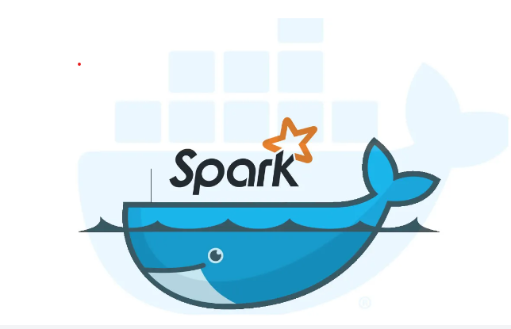

# Apache Spark Playground

This repository contains docker seup of Apache Spark for the purpose of learning, experimenting and hands-on. 
It contains various setups like:

1. Spark Single Node Setup Using Docker
2. Spark cluster (1 Master and 3 Working Nodes)
3. Spark cluster with Kubernetes. 

To know, how to use it, refer the readme file inside each folder. 

