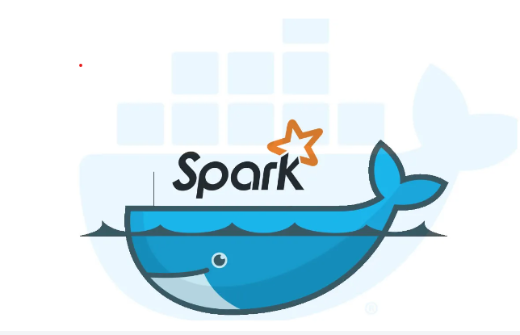

# Apache Spark Playground

This repository contains docker seup of Apache Spark for the purpose of learning, experimenting and hands-on. 
It contains various setups like:

1. Spark Single Node Setup Using Docker
2. Spark Standalone Cluster  (1 Master and scalable Worker Nodes)
3. Spark Yarn Cluster (1 Master and scalable Worker Nodes)
4. Spark cluster with Kubernetes. 

To know, how to use it, refer the readme file inside each folder. 

