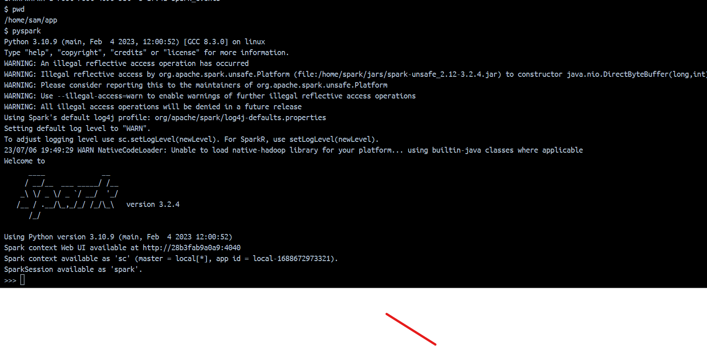
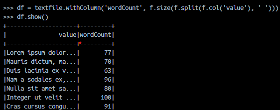
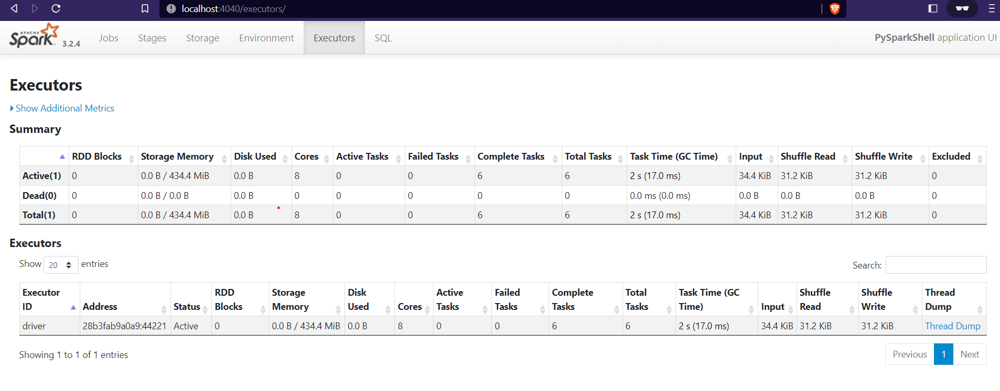

# Spark One Node setup in Docker

This is apache spark one node setup to test Apache spark and for learning purpose. This is an alternative to VM's that 
are big in volume and take too much resources. 

To build the docker image run below command
```
    docker-compose build
```

To run the docker run the `docker-compose up` command as given below. 
```
    docker-compose up -d
```

In order to launch pyspark you can go to the container and type pyspark as given below




Test if spark is setup properly and working file by running below code

```
import pyspark.sql.functions as f

textfile_df = spark.read.text("textfile.txt")
textfile_df.show()
df = textfile_df.withColumn('wordCount', f.size(f.split(f.col('value'), ' ')))
df.show()
wc_df = textfile_df.withColumn('word', f.explode(f.split(f.col('value'), ' '))).groupBy('word').count().sort('count', ascending=False).show()
wc_df.show()
```




In order to launch SparkUI you can go to localhost:4040
Spark UI screenshot given below




### Start Container using start.sh:
To use the script, make sure it has executable permissions (chmod +x start.sh). Then you can run the script with the desired command-line argument.

Examples:

```./start.sh build ```: will build the Docker image using docker-compose build.
```./start.sh run``` will run the container using docker-compose up -d.
```./start.sh build_and_run``` will both build the Docker image and run the container using the respective functions.


### Start Container using start.bat (Windows):
```start.bat build```: Executes the :build function to build the Docker image.
```start.bat run```: Executes the :run function to run the Docker container.
```start.bat build_and_run```: Executes the :build_and_run function to build the image and run the container.


### Start Container using `docker build` command (without using docker-compose):
 Build the image using docker build command as below
```bash
docker build -t my-docker-image .
```


### Then run the image using `docker run` command:
```bash
hostfolder="$(pwd)"
dockerfolder="/home/sam/app"
docker run --rm -it \
  --net="host" \
  -v ${hostfolder}/app:${dockerfolder} \
--entrypoint bash spark-in-docker:latest
```

To run detached from current terminal window:
```bash
docker run -d --rm -it \
    -p 4040:4040 -v ${hostfolder}/app:${dockerfolder} \ 
    docker-spark-single-node:latest
```

Note For Windows-1:
Note that in case of windows, path starts with C:/ which is different than universal path pattern. 
So if you are running from windows then make sure to check the path with volume mapping. 

Note for Windows-2
Note that the host networking driver only works on Linux hosts, and is not supported on Docker Desktop for Mac,
Docker Desktop for Windows, or Docker EE for Windows Server.
Note also that Docker for Windows/Mac won't warn you that it doesn't work - it just runs the container silently 
and DOESN'T bind to any local ports.

I was stuck on this for few hours, trying to access sparkUI. 
https://stackoverflow.com/questions/43316376/what-does-net-host-option-in-docker-command-really-do
