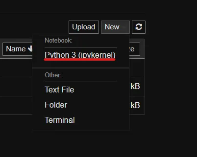

# Spark One Node setup in Docker

This is apache spark one node setup to test Apache spark and for learning purpose. This is an alternative to VM's that 
are big in volume and take too much resources. 

To build the docker image run below command
```
    docker-compose build
```

To run the docker run the `docker-compose up` command as given below. 
```
    docker-compose up -d
```


To run detached from current terminal window using `docker` command / without using `docker-compose` command
```bash
hostfolder="$(pwd)"   # Windows path is f'd up so print it and confirm before proceeding
hostfolder="/C:/Users/Sanjeet/Desktop/git_pod_experient_labs/spark_playground/spark-single-node/app"
dockerfolder="/home/sam/app"
docker run --rm -it \
  -p 4040:4040 -p 4041:4041 \
  -v ${hostfolder}:${dockerfolder} \
spark1n:latest
```

Use below url to access jupyter_notebook [http://localhost:4041](http://localhost:4041)


In order to launch `pyspark` you need to modify dockerfile to uncomment line `#CMD ["sh", "-c", "tail -f /dev/null"]` and comment last line
Then you can go to the container and type pyspark as given below


As an alternative to above step you can launch spark-shell (spark scala shell) without any modification by simply going 
to the container and typing `spark-shell`. The screen shot is given below:


### Jupyter Notebook:
Go to this url [http://localhost:4041](http://localhost:4041). 
It will launch the Jupyter environment as given below. localhost:4041


Create new notebook or open existing one first_notebook.ipynb:




— Now run some basic python code to make sure that python and Jupyter notebook is setup properly.
— Then run following code to find spark and create spark session.

```python
import findspark
findspark.init()
import pyspark
from pyspark.sql import SparkSession
import pyspark.sql.functions as f

# create spark session
spark = SparkSession.builder.appName("SparkSample").getOrCreate()

# read text file
df_text_file = spark.read.text("textfile.txt")
df_text_file.show()

df_total_words = df_text_file.withColumn('wordCount', f.size(f.split(f.col('value'), ' ')))
df_total_words.show()

# Word count example
df_word_count = df_text_file.withColumn('word', f.explode(f.split(f.col('value'), ' '))).groupBy('word').count().sort('count', ascending=False)
df_word_count.show()
```

Screenshot of jupyter notebook running spark code:


In order to launch SparkUI you can go to https://localhost:4040
Spark UI screenshot given below


### For Spark-shell users: 
Test if spark is setup properly and working as expected by running below code or any other code of your choice. 

```
import pyspark.sql.functions as f

textfile_df = spark.read.text("textfile.txt")
textfile_df.show()
df = textfile_df.withColumn('wordCount', f.size(f.split(f.col('value'), ' ')))
df.show()
wc_df = textfile_df.withColumn('word', f.explode(f.split(f.col('value'), ' '))).groupBy('word').count().sort('count', ascending=False).show()
wc_df.show()
```


In order to launch SparkUI you can go to https://localhost:4040
Spark UI screenshot given below


### Start Container using start.sh:
To use the script, make sure it has executable permissions (chmod +x start.sh). Then you can run the script with the desired command-line argument.

Examples:

```./start.sh build ```: will build the Docker image using docker-compose build.
```./start.sh run``` will run the container using docker-compose up -d.
```./start.sh build_and_run``` will both build the Docker image and run the container using the respective functions.


### Start Container using start.bat (Windows):
```start.bat build```: Executes the :build function to build the Docker image.
```start.bat run```: Executes the :run function to run the Docker container.
```start.bat build_and_run```: Executes the :build_and_run function to build the image and run the container.


### Then run the image using `docker run` command:
```bash
hostfolder="$(pwd)"
dockerfolder="/home/sam/app"
docker run --rm -it \
  --net="host" \
  -v ${hostfolder}/app:${dockerfolder} \
--entrypoint bash spark-in-docker:latest
```

To run detached from current terminal window:
```bash
docker run -d --rm -it \
    -p 4040:4040 -v ${hostfolder}/app:${dockerfolder} \ 
    docker-spark-single-node:latest
```


Other way to enter the container and launch jupyter notebook:

```
docker  exec -it 1af493da8cebe92d917abc5efa34086013ebeb9e350cb5bf280c63dabc73330f /bin/sh
```

```
jupyter notebook --ip 0.0.0.0 --port 4041 --no-browser --allow-root --NotebookApp.token='' --NotebookApp.password=''
```

### Known Issues:
The jupyter notebook command used in the Dockerfile is not using any token or password.
So it is not safe for production, However you can easily modify the command to set some password. 


Note For Windows-1:
Note that in case of windows, path starts with C:/ which is different than universal path pattern. 
So if you are running from windows then make sure to check the path with volume mapping. 

Note for Windows-2
Note that the host networking driver only works on Linux hosts, and is not supported on Docker Desktop for Mac,
Docker Desktop for Windows, or Docker EE for Windows Server.
Note also that Docker for Windows/Mac won't warn you that it doesn't work - it just runs the container silently 
and DOESN'T bind to any local ports.

Note-3: 
After migrating from windows, the spark-shell launch was failing with error `java.io.FileNotFoundException: /home/sam/app/spark_events/local-1695546124823.inprogress (Permission denied)`
The error was because of access to the spark_events folder that was used as a volume to the spark image.
Solution was to change the access using `chmod` command. `chmod 777 app/spark_events/`.


Note-4: New notebook was unable to save in the mounted directory. Sol: updated access for mounted directory and sub directories to 777. 
