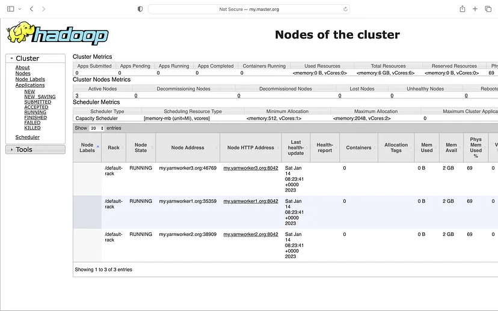
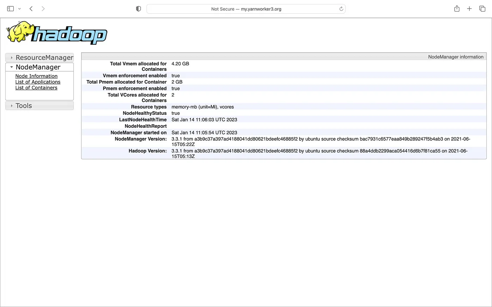
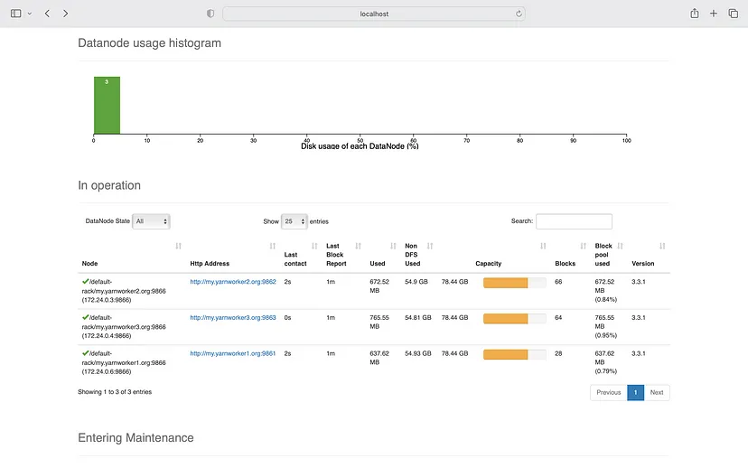
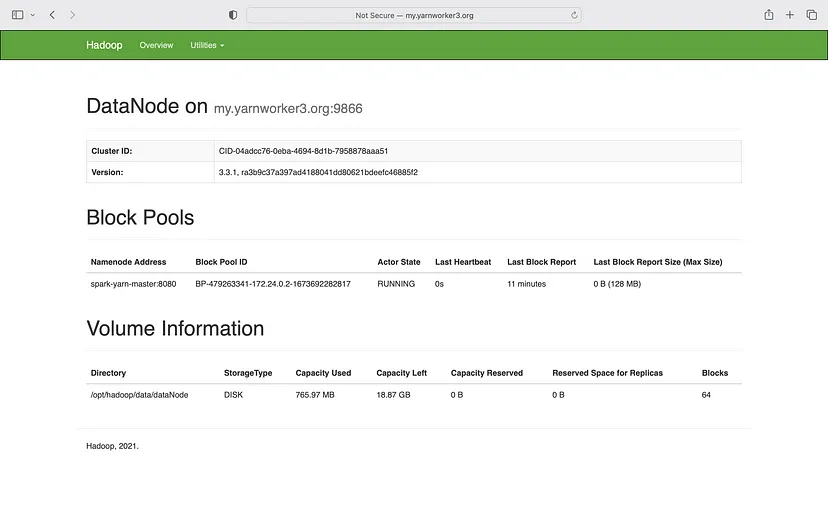

# Spark YARN Cluster in Docker
This project is based on [Spark Yarn cluster](https://github.com/experientlabs/spark_playground/tree/main/spark-multinode-yarn) plus ability to browser datanode through hostname url. 
In general when we setup Spark yarn cluster, the url in web interface don't work. 
Because host names are randomly assigned by docker and DNS resolver does not know about it. 
So in this setup we expose docker hostname to the host machine so that hostname becomes accessible.


# Running Cluster and Adding the hostnames to /etc/hosts
Run `make run-ag n=3` and wait untill cluster starts, then run the script to modify the dns `make dns-modify o=true n=3`
1. `make run-ag n=3`
2. `make dns-modify o=true n=3`

After running `make run-ag n=3` you can visit this url [my.master.org:8088/cluster/nodes](my.master.org:8088/cluster/nodes) 
or [localhost:8088/cluster/nodes](localhost:8088/cluster/nodes) you’ll get the following web interface:

Alternatively you can also use localhost to visit all nodes like [localhost:8088/cluster/nodes](localhost:8088/cluster/nodes)




Now if we click on a node and the link will work. That is the goal of this project



We can also go to the NameNode web interface (port 9870) and click on one of the links there:



yarn worker 3:



## Restoring your /etc/hosts file from backup
There is a shell script to restore the original file to /etc/hosts from one of the backups. You can start the script:

`sudo make dns-restore`
Which in the background executes the command:
`sh ./dns_scripts/restore_hosts_from_backup.sh`


Issues
1. The issue with this solution is that all of the hostnames point to localhost. This means that if you were, e.g. yarn.worker1.org:8042 and changed only the port number so you end up with this: yarn.worker1.org:18080 you will see the spark history server, despite being on the yarn worker hostname. However, I don’t honestly know how to solve this since everything is actually pointing to localhost.
2. Another bug is that generate-docker-compose.sh generates docker-compose with some alignment issue that I need to fix as time permits.
References and Credits:
https://medium.com/@MarinAgli1/using-hostnames-to-access-hadoop-resources-running-on-docker-5860cd7aeec1
https://github.com/dvddarias/docker-hoster


TODO:
To add Airflow container
Explore container orchestration tools
    1. Kubernetes
    2. Docker Swarm


Future Roadmap: 
Keep all features in same branch as much as possible to ease the maintenance efforts.  


```
sed -i -e 's/\r$//' dns_scipt/add_docker_hosts.sh
```

Bugfix:
updated `spark-yarn-hostname/generate-docker-compose.sh` to fixt the new line character. 

```bash
text="first \nsecond \nthird"
echo $text
first \nsecond \nthird
```
```bash
text="first \nsecond \nthird"
echo -e $text
first 
second
third
```

